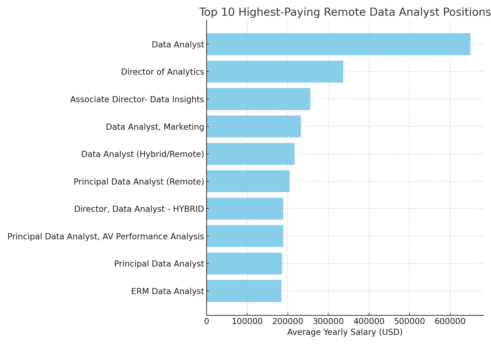
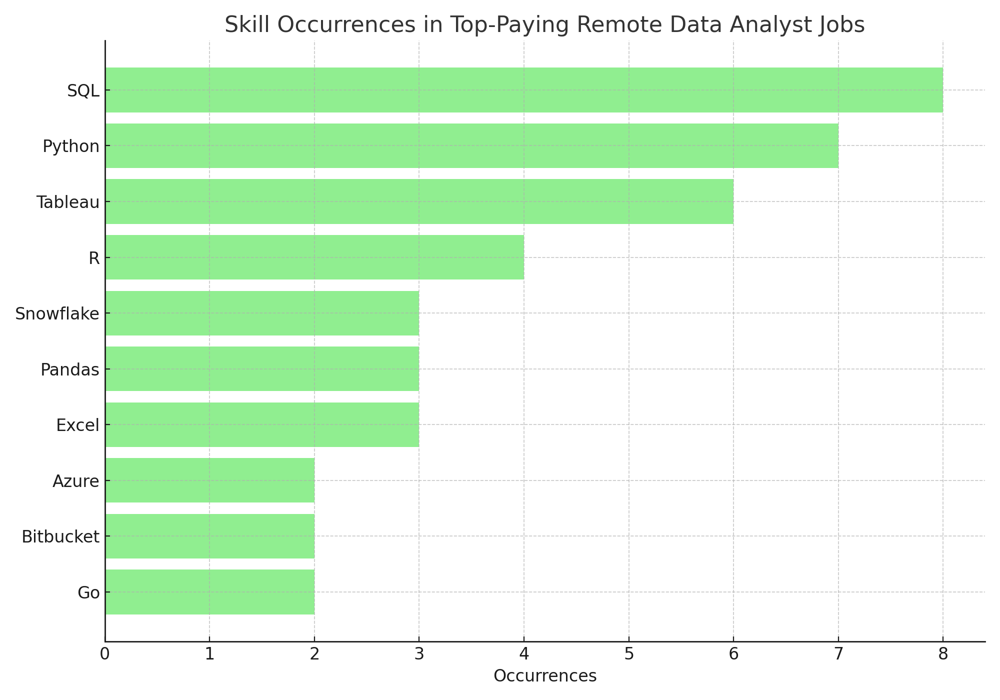
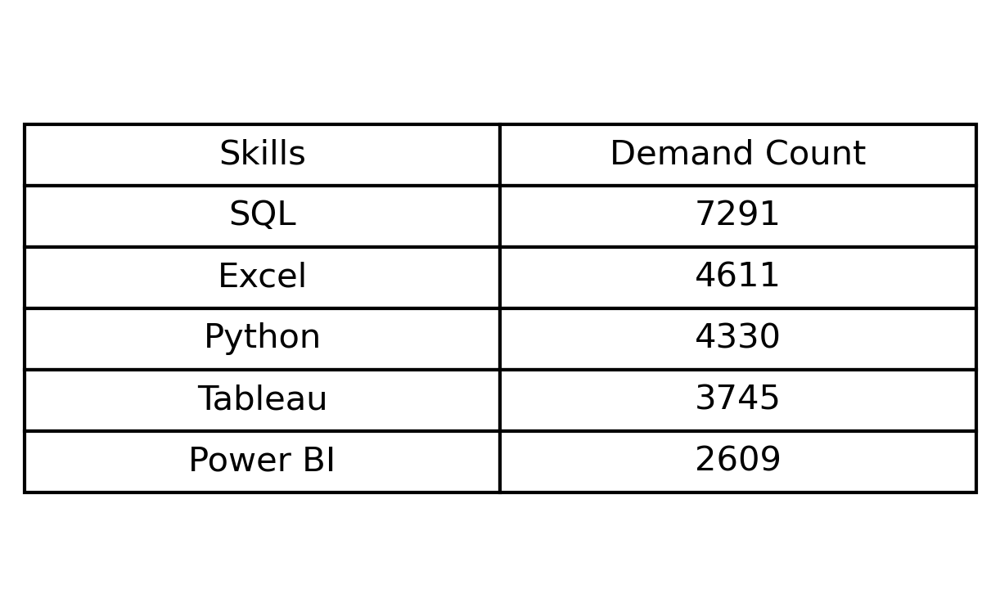
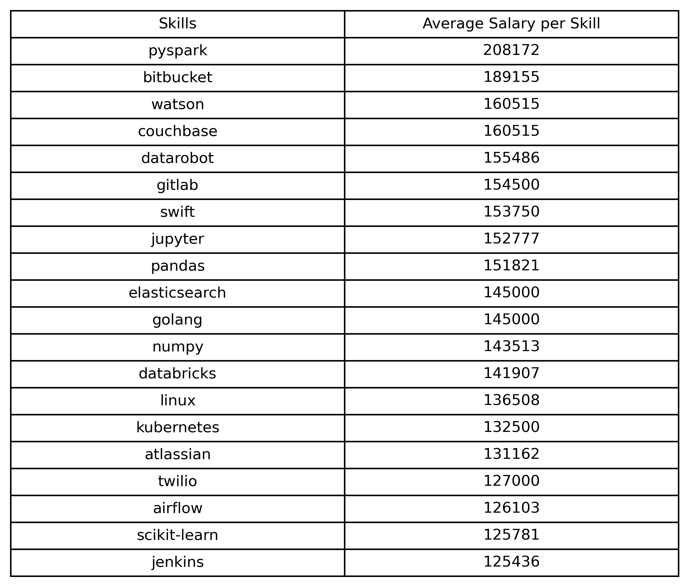
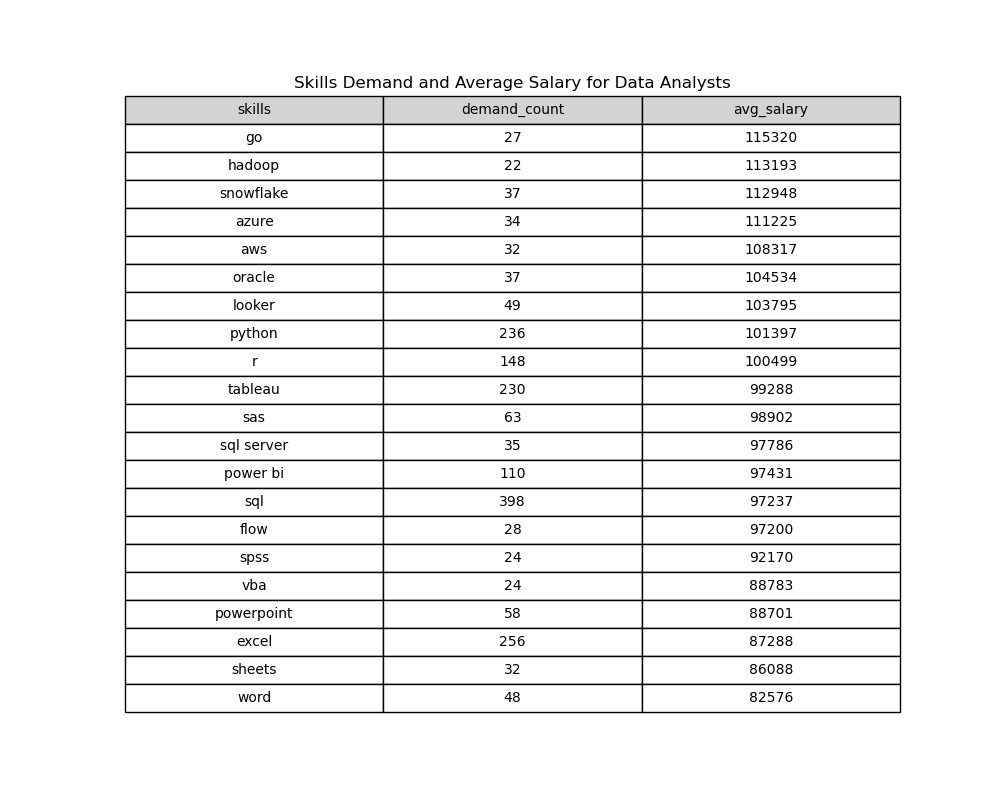

# Introduction
This project dives into the dynamic world of data analyst roles, uncovering key insights about the current job market. By answering questions like what are the top-paying data analyst jobs, identifying the most in-demand skills, and exploring where high demand meets high salaries, this analysis provides a comprehensive overview of the opportunities and trends in the field of data analytics (a project idea by [lukebarousse ](https://github.com/lukebarousse) ).

Designed as a guide for both aspiring and current data analysts, this project helps navigate the job market and capitalize on the most lucrative opportunities.

### My goal in exploring this dataset was was to uncover:

- [The top-paying data analyst jobs](#the-top-paying-data-analyst-jobs)
2. The skills required for these top-paying roles.
3. The most in-demand skills for data analysts.
4. The top skills based on salary.
5. The most valuable skills to learn balancing high demand and high pay.

Feel free to check out the queries for this analysis here : [project_queries](/project_queries/)

# My Tools for the Project

- **PostgreSQL :** The powerhouse database that combines reliability with cutting-edge features.
- **VS Code :** Your ultimate code editor for seamless coding and debugging adventures.
- **SQL :** The language that brings your data to life with precision and power.
- **Git :** The version control wizard that keeps your code history tidy and collaborative.
- **GitHub :** Essential for sharing my SQL scripts and analysis, ensuring collaboration and project tracking

# The Analysis

Each query focused on exploring unique dimensions of the data analyst job market, offering detailed answers to key questions about industry trends and opportunities.

### The top paying Data Analyst jobs.
In this query i try to identify the the top 10 highest-paying data analyst positions that offer remote work opportunities. I filter out entries where the average annual salary is null, ensuring only valid salary data is considered.

```sql
SELECT
    job_postings_fact.job_id,
    job_postings_fact.job_title,
    job_postings_fact.job_location,
    job_postings_fact.salary_year_avg,
    company_dim.name AS company_name
FROM
    job_postings_fact
LEFT JOIN company_dim
ON job_postings_fact.company_id = company_dim.company_id
WHERE salary_year_avg is not NULL 
    AND job_title_short = 'Data Analyst'
    AND job_work_from_home is TRUE
ORDER BY salary_year_avg DESC
LIMIT 10
```

Here's the breakdown of the top data analyst jobs in 2023:

- **Wide Salary Range:** Top 10 paying data analyst roles span from $184,000 to $650,000, indicating significant salary potential in the field.
- **Diverse Employers:** Companies like SmartAsset, Meta, and AT&T are among those offering high salaries, showing a broad interest across different industries.
- **Job Title Variety:** There's a high diversity in job titles, from Data Analyst to Director of Analytics, reflecting varied roles and specializations within data analytics.


*Bar chart visualizing the avg annual salary for the top 10 data analyst jobs.This graph was created by ChatGPT using my SQL query results*

### 2. The Skills you need to acquire for the top-paying Data Analyst jobs.
In this query i try to identify and provide insights into the specific skills required for the top 10 highest-paying remote Data Analyst jobs by joining he job postings with the skills data.

```sql
WITH top_paying_jobs AS(
    SELECT
        job_postings_fact.job_id,
        job_postings_fact.job_title,
        job_postings_fact.job_location,
        job_postings_fact.salary_year_avg,
        company_dim.name AS company_name
    FROM
        job_postings_fact
    LEFT JOIN company_dim
    ON job_postings_fact.company_id = company_dim.company_id
    WHERE salary_year_avg is not NULL 
        AND job_title_short = 'Data Analyst'
        AND job_work_from_home is TRUE
    ORDER BY salary_year_avg DESC
    LIMIT 10
)

SELECT
    top_paying_jobs.*,
    skills_dim.skills,
    skills_dim.type
    
FROM
    top_paying_jobs
INNER JOIN skills_job_dim ON top_paying_jobs.job_id = skills_job_dim.job_id
INNER JOIN skills_dim ON skills_job_dim.skill_id = skills_dim.skill_id;
```

Here's the breakdown of the most demanded skills for data analysts in 2023, based on job postings:

- **SQL** (8 occurrences)
- **Python** (7 occurrences)
- **Tableau** (6 occurrences)
- **R** (4 occurrences)
- **Snowflake** (3 occurrences)
- **Pandas** (3 occurrences)
- **Excel** (3 occurrences)
- **Azure** (2 occurrences)
- **Bitbucket** (2 occurrences)
- **Go** (2 occurrences)


*The bar chart displaying the occurrences of skills in the top-paying remote Data Analyst jobs.This graph was created by ChatGPT using my SQL query results*

### 3. Top in-demand Skills for Data Analyst jobs.
Joining the job postings with the skills data i identify the top 5 skills that are in the highest demand for remote Data Analyst positions by highlighting which skills are most commonly required by employers.

```sql
SELECT
    skills,
    COUNT(job_postings_fact.job_id) as demand_count
FROM  job_postings_fact
    INNER JOIN skills_job_dim ON job_postings_fact.job_id = skills_job_dim.job_id
    INNER JOIN skills_dim ON skills_job_dim.skill_id = skills_dim.skill_id
WHERE job_title_short LIKE 'Data Analyst'  AND job_work_from_home is TRUE
GROUP BY skills
ORDER BY demand_count DESC
LIMIT 5
```

Here's the breakdown of the most demanded skills for data analysts in 2023.
- **SQL** is the most in-demand skill, significantly leading the others.
- **Excel** and **Python** also have high demand, indicating a strong preference for these skills in data analysis roles.
- **Tableau** and **Power BI** are highly valued, reflecting the importance of data visualization tools in the industry.


*Table of the demand for the top 5 skills in remote data analyst job postings.This table visualization was created with Python after importing my SQL query results*

### 4. The top paying Skills based on salary
In this query by joining the job postings with skills data and averaging the salaries per skill i associate each job with the required skills and identify which skills are associated with higher salaries for remote Data Analyst jobs. This insight can be useful for prioritizing skill development in the field.

```sql
SELECT
    skills,
    ROUND(AVG(salary_year_avg), 0) AS avg_salary_per_skill
FROM  job_postings_fact
    INNER JOIN skills_job_dim ON job_postings_fact.job_id = skills_job_dim.job_id
    INNER JOIN skills_dim ON skills_job_dim.skill_id = skills_dim.skill_id
WHERE
    job_title_short LIKE 'Data Analyst'
    AND salary_year_avg IS NOT NULL
    AND job_work_from_home is TRUE
GROUP BY
    skills
ORDER BY
    avg_salary_per_skill DESC
LIMIT 20
```

Here's a breakdown of the results for top paying skills for Data Analysts:

**1. Emergence of Big Data and Cloud Technologies:**
Top Skills: PySpark, Databricks, Elasticsearch, Kubernetes, Airflow

**2. Integration with Machine Learning and AI Platforms:**
Top Skills: Watson, DataRobot, Scikit-learn, Jupyter, Pandas, Numpy

**3. Emphasis on DevOps and Continuous Integration/Deployment:**
Top Skills: Bitbucket, GitLab, Jenkins, Linux

**4. Focus on Programming Languages:**
     Top Skills: Golang, Swift

**5. Specialized Data Management and Workflow Tools:**
Top Skills: Couchbase, Atlassian, Twilio

**6. High Demand for Data Orchestration and Automation:**
Top Skills: Airflow, Jenkins

**7. Open Source Tools and Frameworks:**
Top Skills: Jupyter, Pandas, Numpy, Scikit-learn, Golang, Linux


*The table  shows the top 20 paying skills based on the average salaries.This table visualization was created with Python after importing my SQL query results*

### 5. The most valuable Skills to learn balancing high demand and high pay
Here i integrate demand and salary data to identify the most in-demand skills for remote Data Analyst positions, along with their average salaries, prioritizing skills that are both highly paid and frequently requested.

```sql
SELECT 
    skills_dim.skills,
    COUNT(skills_job_dim.job_id) AS demand_count,
    ROUND(AVG(job_postings_fact.salary_year_avg), 0) AS avg_salary
FROM job_postings_fact
INNER JOIN skills_job_dim ON job_postings_fact.job_id = skills_job_dim.job_id
INNER JOIN skills_dim ON skills_job_dim.skill_id = skills_dim.skill_id
WHERE
    job_title_short = 'Data Analyst'
    AND salary_year_avg IS NOT NULL
    AND job_work_from_home = True
GROUP BY
    skills_dim.skill_id
HAVING
    COUNT(skills_job_dim.job_id) > 20
ORDER BY
    avg_salary DESC,
    demand_count DESC 
LIMIT 25
```

Here's a breakdown of the most optimal skills for Data Analysts in 2023:

The trends highlighted by these skills suggest that the role of a data analyst
in 2023 is becoming increasingly complex and integrated with various technologies.
- The demand for cloud computing, big data technologies **(Hadoop, Snowflake, Azure, AWS, Oracle)**, and advanced programming languages **(Go, Python, R)** indicates a shift towards more technical and scalable solutions.
- Meanwhile, the importance of data visualization and business intelligence tools **(Looker, Tableau, Power BI)**
emphasizes the need for data analysts to not only analyze data but also present it in an accessible and impactful way.
- Additionally, the enduring relevance of traditional database management **(SQL, SQL Server, SPSS, SAS)** and office productivity tools **(Excel, PowerPoint, Word, Sheets)** shows that a well-rounded skill set is crucial for success in this evolving field.


*Table of the most optimal skills (high demand and high pay) for remote data analysts sorted by salary.This table visualization was created with Python after importing my SQL query results*


# Conclusion

Through detailed queries and visualizations, several key insights have emerged:

1.**Top-paying Data Analyst Jobs:** Remote roles for data analysts offer a wide salary range, with positions at high-profile companies such as Meta and AT&T commanding salaries well into six figures. This highlights the significant earning potential in the field, especially for those with specialized skills.

2.**Key Skills for Top-paying Roles:** The most lucrative positions often require expertise in a mix of technical and data-oriented skills, such as SQL, Python, and Tableau. These core skills are essential for data analysts seeking to advance in their careers and secure high-paying opportunities.

3.**In-demand Skills for Data Analysts:** SQL dominates as the most sought-after skill, followed by Excel, Python, and data visualization tools like Tableau and Power BI. This demonstrates the importance of both foundational data processing skills and advanced analytics tools.

4.**Top-paying Skills:** Proficiency in emerging technologies, particularly in big data and machine learning tools like PySpark, Databricks, and Watson, correlates with higher salaries. This underscores the value of staying ahead of technological advancements to maximize earning potential.

5.**Most Valuable Skills (Balancing Demand and Pay):** The analysis reveals that skills with both high demand and competitive salaries, such as SQL, Python, and Tableau, offer the most promising career opportunities. Mastering these technologies ensures both employability and substantial financial rewards.

### Final Thoughts

The role of a data analyst in 2023 is increasingly technical and multifaceted, requiring a broad range of skills from data management to advanced analytics. Aspiring analysts and those already in the field should focus on developing a mix of technical expertise in key tools and platforms while staying attuned to emerging trends in cloud computing, big data, and automation. By aligning skill development with the most valuable and in-demand technologies, data analysts can position themselves for success in a competitive job market.
